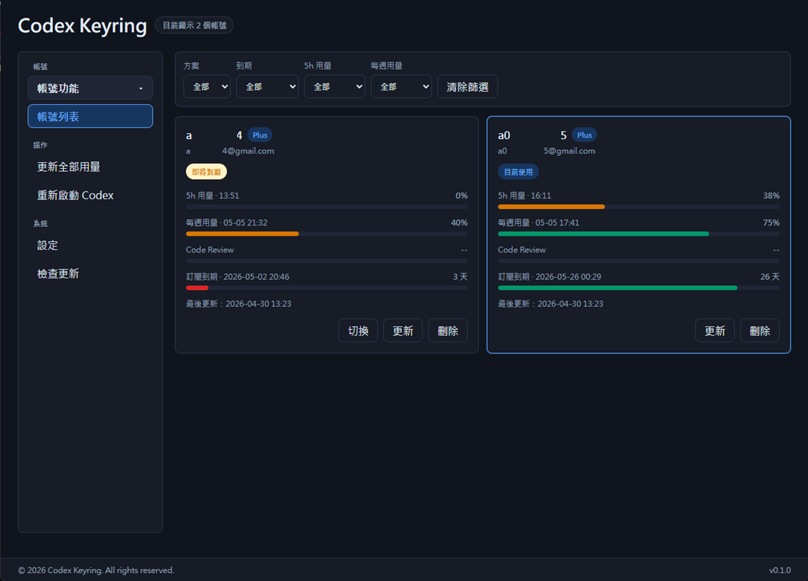
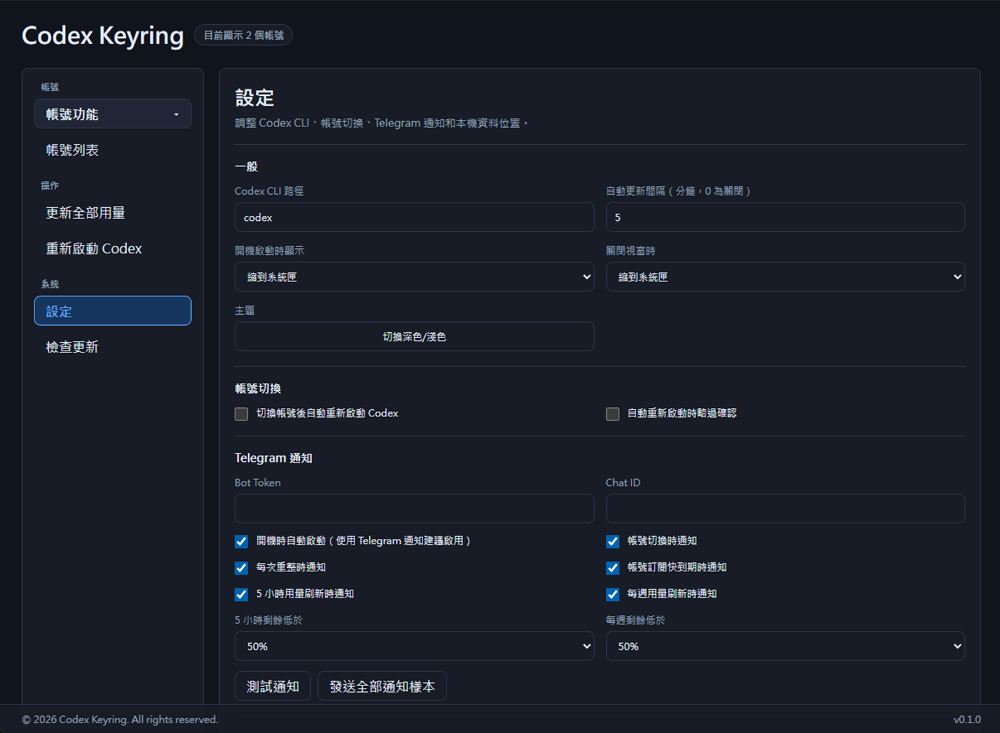
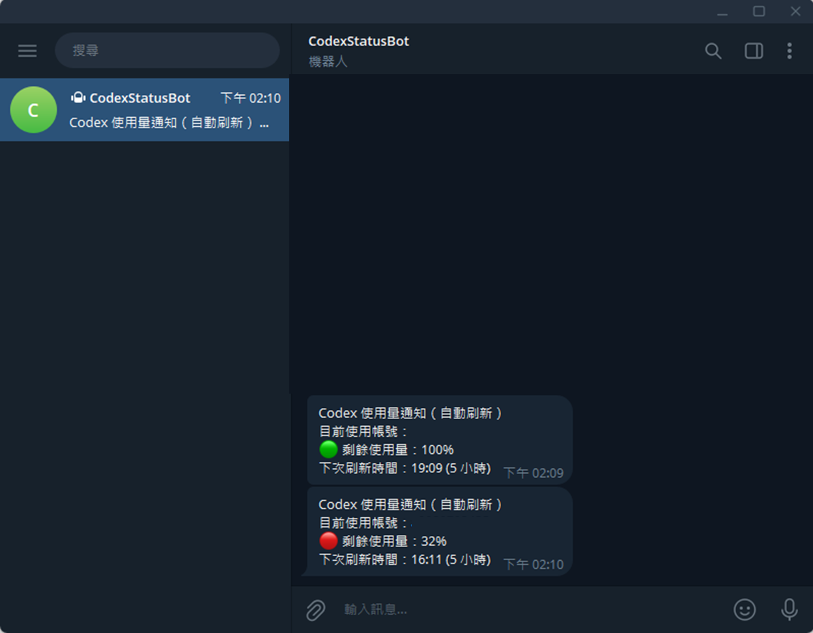

# Codex Keyring

Codex Keyring 是一個 Windows 桌面工具，用來管理多個 OpenAI Codex 帳號，並快速切換 `auth.json`。

## 主要功能

- 多帳號管理與一鍵切換（寫回 `%USERPROFILE%\.codex\auth.json`）
- 用量監控（5 小時 / 每週 / Code Review）
- Telegram 通知（可設定通知時機與門檻）
- 開機自啟（可選顯示主視窗或縮到系統匣）
- 檢查更新與本機資料夾快速開啟

## 畫面預覽

### 帳號列表


### 設定頁


### Telegram 通知


## 快速開始（一般使用者）

在 PowerShell 執行以下一行，會把最新版本 EXE 下載到桌面：

```powershell
$repo='Kelu0427/Codex-Keyring'; $asset=(Invoke-RestMethod "https://api.github.com/repos/$repo/releases/latest").assets | Where-Object { $_.name -like "*.exe" } | Select-Object -First 1; Invoke-WebRequest $asset.browser_download_url -OutFile "$env:USERPROFILE\Desktop\$($asset.name)"
```

下載後直接執行 `Codex-Keyring.exe` 即可。

## 本機資料位置

```text
帳號與設定：
%LOCALAPPDATA%\codex-keyring\accounts.json

帳號 auth 備份：
%USERPROFILE%\.codex_keyring\auths\{accountId}.json

目前 Codex auth：
%USERPROFILE%\.codex\auth.json
```

## 注意事項

- 資料儲存在本機，不會主動上傳第三方。
- auth 與設定目前為明文 JSON，請妥善保護本機帳號與檔案權限。
- 若要穩定收到 Telegram 排程通知，建議啟用開機自動啟動。

## License

MIT License。詳見 [LICENSE](LICENSE)。

